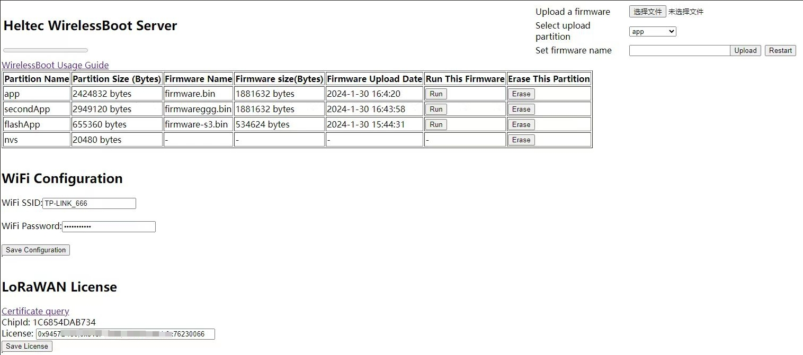
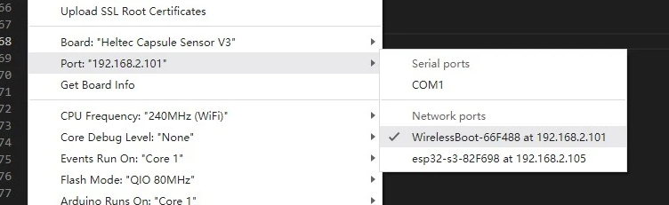
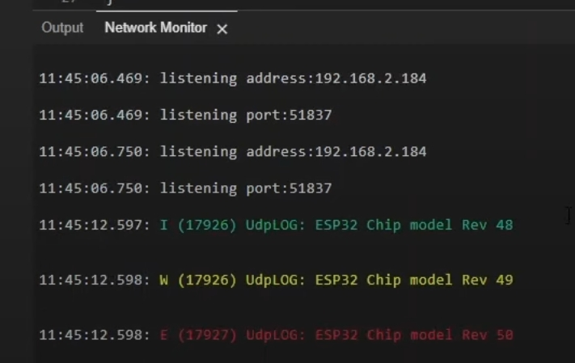

# Heltec WirelessBoot System

Wireless Boot is a boot-loader system for ESP32 MCU, when the system enters the Bootloader, the Wi-Fi will be enabled.  Users can download firmware, exchange information, and print logs through WiFi. Therefore, devices no longer require a USB-UART bridge, which can reduce the system's hardware cost and device size.

The WirelessBoot System can achieve the following functions:

1. **Firmware can be uploaded through the management page.**

2. **Loading network ports in Arduino IDE.**

3. **Debug information and log print**

## Development

The WirelessBoot is development based on `ESP-IDF`, `ESP32-S3` `release/V5.1`, all relevant work include Install, set up development environment, compile, programming device, etc. please refer to ESPRESSIF [ESP-IDF Programming Guide](https://docs.espressif.com/projects/esp-idf/en/release-v5.1/esp32s3/get-started/linux-macos-setup.html).

WirelessBoot system need `mDNS Service` component. To add mDNS component in this project, please run `idf.py add-dependency espressif/mdns`. More info. about mDNS, please refer to [mDNS Service](https://docs.espressif.com/projects/esp-idf/en/release-v5.1/esp32s3/api-reference/protocols/mdns.html).

## Usage

How to use the WirelessBoot system in your device, please refer to [Heltec WirelessBoot System](https://docs.heltec.org/en/node/esp32/wireless_boot/index.html).
